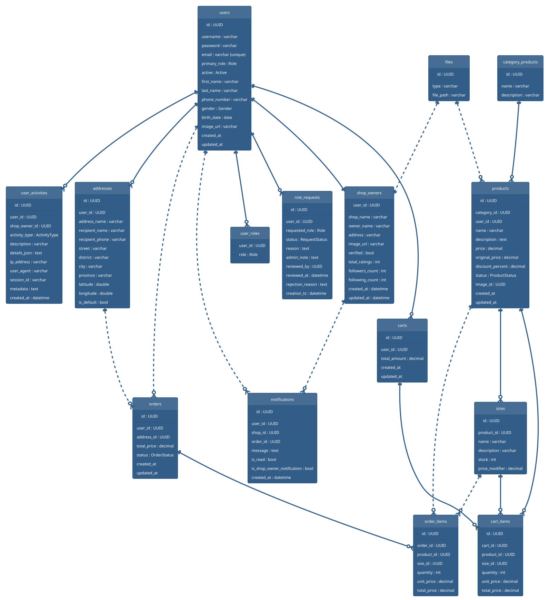

# 📘 TÀI LIỆU CHỨC NĂNG & CSDL

Tài liệu này tổng hợp các vai trò người dùng, luồng chức năng, mức độ hoàn thiện và mô hình cơ sở dữ liệu của dự án Shopee Clone. Nội dung nằm cùng cấp với `HUONG_DAN.md` để tiện tra cứu song song: `HUONG_DAN.md` tập trung vào triển khai, còn tài liệu này tập trung vào phạm vi nghiệp vụ và dữ liệu.

---

## 🎯 Mục Tiêu
- Diễn giải microservice nào đang chịu trách nhiệm cho từng phần của “một trang Shopee”.
- Làm rõ các vai trò (User, Shop Owner, Admin) và chức năng tương ứng đã/đang/chưa hoàn thiện.
- Chuẩn hóa kiến thức về schema để đồng bộ backend – frontend – DevOps.
- Cung cấp PlantUML để dựng ERD nhanh khi cần trao đổi.

---

## 1. Kiến Trúc & Dịch Vụ

| Service | Port | Nhiệm vụ chính | Lưu trữ/Dữ liệu |
| --- | --- | --- | --- |
| `config-server` | 8888 | Phân phối cấu hình chung cho toàn bộ services. | Git-backed config |
| `eureka-server` | 8761 | Service registry cho Gateway và các service nội bộ. | In-memory |
| `gateway` | 8080 | Entry point duy nhất, định tuyến `/v1/**` và `/ws/notifications/**`, inject JWT filter. | Stateless |
| `auth-service` | 8001 | Đăng ký/đăng nhập, Google OAuth, OTP quên mật khẩu, phát hành JWT. | Redis (OTP), MySQL (user-service) qua Feign |
| `user-service` | 8002 | Hồ sơ người dùng, sổ địa chỉ, quản lý role request, shop owner profile. | MySQL (`users`, `addresses`, `role_requests`, `shop_owners`, `user_activities`, `user_roles`) |
| `file-storage` | 8000 | Upload/download/xóa file ảnh cho avatar & sản phẩm. | MySQL (`files`) + filesystem |
| `stock-service` | 8004 | Danh mục, sản phẩm, size/stock, giỏ hàng (Redis + MySQL). | MySQL (`category_products`, `products`, `sizes`, `carts`, `cart_items`), Redis cart cache |
| `order-service` | 8005 | Checkout qua Kafka, quản lý đơn, đồng bộ tồn kho, gửi notification. | MySQL (`orders`, `order_items`), Kafka |
| `notification-service` | 8009 | Lưu + push thông báo realtime (Kafka -> WebSocket). | MySQL (`notifications`) |
| `merier-fe` (Vite) | 5173 | Giao diện khách hàng, chủ shop, admin. | Local storage / REST |
| `docker-compose` hạ tầng | - | MySQL, Redis, Kafka, Zookeeper, Kafka UI. | Docker volumes |

---

## 2. Vai Trò Người Dùng

| Vai trò | Mô tả | Quyền chính |
| --- | --- | --- |
| Guest | Khách chưa đăng nhập. | Xem catalogue, trang chủ, chi tiết sản phẩm. |
| User (Role.USER) | Khách hàng đăng nhập. | Giỏ hàng, đặt hàng, theo dõi đơn, nhận thông báo. |
| Shop Owner (Role.SHOP_OWNER) | Chủ shop đã được duyệt. | Quản lý hồ sơ shop, tạo/cập nhật sản phẩm, xem đơn thuộc shop. |
| Admin (Role.ADMIN) | Quản trị hệ thống. | Duyệt yêu cầu lên shop owner, quản lý user, categories, giám sát đơn. |

---

## 3. Ma Trận Chức Năng & Trạng Thái

| Nhóm | Chức năng | Backend chính | Frontend chính | Trạng thái | Ghi chú |
| --- | --- | --- | --- | --- | --- |
| Auth | Đăng ký/Đăng nhập bằng email/password | `auth-service`, `user-service` | `pages/client/AuthPage.jsx` | ✅ Hoàn thành | JWT + password encoder. |
| Auth | Google OAuth2 login callback `POST /v1/auth/login/google` | `auth-service` | `pages/client/GoogleCallback.jsx` | ✅ Hoàn thành | Client ID `9410...`, redirect `http://localhost:5173/oauth2/callback`. |
| Auth | OTP quên mật khẩu (send/verify/update) | `auth-service` + Redis | `pages/client/ForgotPasswordPage.jsx`, `VerifyOtpPage.jsx`, `ResetPasswordPage.jsx` | ✅ Hoàn thành | OTP cache trong Redis, gửi Gmail SMTP. |
| User Profile | Xem/cập nhật thông tin, avatar upload | `user-service` (`/v1/user/update`), `file-storage` | `components/client/userPage/*` | ✅ Hoàn thành | Upload multipart có kèm file. |
| Address Book | CRUD address, đặt mặc định, geo fields | `user-service` `/v1/user/address/*` | `components/client/userPage/Address.jsx` | ✅ Hoàn thành | Có lat/long để tính distance. |
| Role Request | User xin nâng cấp shop owner, Admin duyệt/reject | `user-service` `/v1/user/role-requests` | `pages/client/UserPage.jsx`, `pages/admin/RolesPage.jsx` | ✅ Hoàn thành | Lưu audit (adminNote, reviewedBy). |
| Shop profile | Lấy & cập nhật thông tin shop owner + logo | `user-service` `/v1/user/shop-owners` | `pages/shop-owner/SettingsPage.jsx` | ✅ Hoàn thành | Multipart support, verify flag. |
| Catalogue | CRUD category, list/search product, size/stock | `stock-service` (`/v1/stock/category`, `/product`, `/size`) | `pages/admin/categories/*`, `pages/shop-owner/AddProductPage.jsx`, `pages/client/ProductPage.jsx` | ✅ Hoàn thành | Có filter keyword, paging, size-level stock. |
| File | Upload/download ảnh sản phẩm/avatar | `file-storage` `/v1/file-storage` | Used by product & user forms | ✅ Hoàn thành | Trả về id để các service tham chiếu. |
| Cart | Giỏ hàng theo user, thêm/sửa/xóa, đồng bộ Redis/MySQL | `stock-service` `/v1/stock/cart/*` | `pages/client/CartPage.jsx` | ✅ Hoàn thành | Tính totalAmount server-side. |
| Checkout | Đặt hàng từ cart, validate tồn kho, gửi Kafka | `order-service` `/v1/order/create-from-cart` | `pages/client/OrderPage.jsx` | ✅ Hoàn thành | Topic `order-topic`, cập nhật stock và cart cleanup. |
| Order tracking | User xem lịch sử, shop owner xem orders by product owner | `order-service` `/v1/order/...` | `pages/client/OrderPage.jsx`, `pages/shop-owner/AllProductsPage.jsx` | ✅ Hoàn thành | Shop owner endpoints có kiểm tra quyền dựa trên productIds. |
| Notifications | Lưu + mark read + realtime WebSocket | `notification-service` | `hooks/useWebSocketNotification.js`, `pages/shop-owner/NotificationPage.jsx` | ✅ Hoàn thành | Kafka topic `notification-topic`, Nginx proxy `/api/ws`. |
| Admin | Quản lý user (`/v1/user/getAll`, update, delete) | `user-service` | `pages/admin/AdminDashboard.jsx` | ✅ Hoàn thành | Cấp quyền thông qua JWT role ADMIN. |
| Admin | Quản lý category/product ở góc admin | `stock-service` | `pages/admin/CategoriesPage.jsx`, `products/*` | ✅ Hoàn thành | Dùng cùng API với shop owner, UI khác. |
| Shop Owner UX | Bulk shipping, return order, analytics UI | (chưa có endpoint chuyên biệt) | `pages/shop-owner/BulkShippingPage.jsx`, `ReturnOrderPage.jsx`, `AnalyticsPage.jsx` | 🟡 Frontend-only | Cần bổ sung API thống kê/ghép vận đơn ở backend. |
| Payments | Tích hợp cổng thanh toán | (chưa có) | (chưa có) | ⬜ Chưa triển khai | Order chỉ hỗ trợ COD logic cơ bản, chưa có thanh toán online. |
| Reviews | Đánh giá sản phẩm/đơn | (chưa có) | (chưa có) | ⬜ Chưa triển khai | Không có entity/comment service. |

---

## 4. Mô Hình Cơ Sở Dữ Liệu

### 4.1 User-Service (`users`, `addresses`, `role_requests`, `shop_owners`, `user_activities`, `user_roles`)
- `users`: UUID `id`, `username`, `password`, `email` (unique), `primary_role`, `roles` (ElementCollection -> `user_roles`), trạng thái `active`, embedded `user_details` (first/last name, gender, phone, birthDate, imageUrl…).
- `user_roles`: bảng phụ `{user_id, role}` để lưu nhiều quyền mỗi tài khoản.
- `addresses`: thuộc tính `userId`, tên địa chỉ, người nhận, phone, tỉnh/thành, city/district, street, `isDefault`, có lat/long để tính khoảng cách.
- `role_requests`: liên kết `user_id`, `requestedRole`, `status`, `reason`, `adminNote`, `reviewedBy`, `reviewedAt`, `rejectionReason`.
- `shop_owners`: share khóa `user_id`, chứa `shopName`, `ownerName`, `address`, `imageUrl`, `verified`, counters (followers, totalRatings), timestamps.
- `user_activities`: log hành vi (`userId`, `shopOwnerId`, `activityType`, mô tả, metadata JSON, ip/userAgent/sessionId, createdAt).

### 4.2 File-Storage (`files`)
- `files`: `id` tự cấp (UUID string từ controller), `type` MIME, `filePath`. Nội dung thật lưu trên filesystem `attachments/`.

### 4.3 Stock-Service (`category_products`, `products`, `sizes`, `carts`, `cart_items`)
- `category_products`: `name`, `description`. Một category có nhiều `products`.
- `products`: thuộc tính `name`, `description`, `price`, `originalPrice`, `discountPercent`, `status`, `imageId`, `userId` (shop owner sở hữu), FK `category_id`, 1-n `sizes`.
- `sizes`: `name`, `description`, `stock`, `priceModifier`, FK `product_id`.
- `carts`: `userId`, `totalAmount`, 1-n `cart_items`.
- `cart_items`: liên kết tới `product_id`, `size_id`, `quantity`, `unitPrice`, `totalPrice`, `cart_id`.

### 4.4 Order-Service (`orders`, `order_items`)
- `orders`: `userId`, `addressId`, `totalPrice`, `orderStatus` (`PENDING`, ...), timestamps.
- `order_items`: `productId`, `sizeId`, `quantity`, `unitPrice`, `totalPrice`, FK `order_id`.
- Liên kết chéo: service chỉ lưu khóa ngoại dạng chuỗi; thông tin sản phẩm/size/address được enrich thông qua Feign `stock-service` & `user-service`.

### 4.5 Notification-Service (`notifications`)
- `notifications`: `userId`, `shopId`, `orderId`, `message`, cờ `is_read`, cờ `is_shop_owner_notification`, `creationTimestamp`.
- Mỗi event được tạo từ Kafka listener và phát realtime đến frontend qua `/ws/notifications`.

---

## 5. PlantUML ER Diagram

Sao chép đoạn mã dưới đây vào [PlantUML](https://www.plantuml.com/plantuml) hoặc IntelliJ plugin để dựng ERD kết hợp các service. Các mối quan hệ chéo microservice được biểu diễn bằng nét đứt (tham chiếu theo ID, không có FK vật lý).

---

## 6. Khoảng Trống & Đề Xuất
- **Thanh toán & vận chuyển**: chưa có entity/payment gateway nào; cần service hoặc tích hợp bên thứ ba trước khi go-live.
- **Trả hàng / hoàn tiền**: UI có `ReturnOrderPage.jsx` nhưng backend thiếu API/state machine; cần bổ sung bảng `return_requests`.
- **Analytics shop**: trang `AnalyticsPage.jsx` dùng số giả; cần endpoints thống kê (doanh thu theo ngày, sản phẩm bán chạy) từ `order-service`.
- **Phân quyền UI**: Gateway kiểm tra JWT nhưng frontend vẫn cần guard phụ (`components/admin/ProtectedRoute.jsx`), nên đồng bộ menu theo role từ server.
- **Bảo mật file**: `file-storage` trả file raw không kiểm tra quyền sở hữu; xem xét ký URL tạm hoặc add token.
- **Observability**: chưa có Prometheus/Zipkin; nên bổ sung để giám sát Kafka & latency Gateway.

---

> Khi cập nhật chức năng hoặc schema, hãy đồng bộ tài liệu này cùng lúc để mọi thành viên đều có cùng “bức tranh Shopee” mới nhất.

